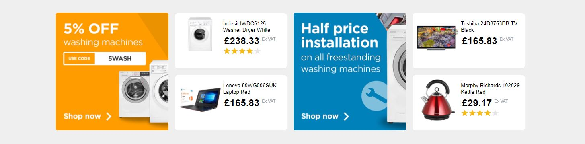

# Flexercise

## Setup

1. Make sure you've got [npm](https://nodejs.org/en/download/) installed on your machine
1. Install the project with `npm i`
1. Spin up the project with `npm run dev`

## Exercise

Build a simple 3 column layout, similar to the layout below:

The layout __must__:

1. Be made with flexbox
1. Be made with rows, not columns
1. Have more than 1 row

If you’re feeling brave, create a 2 column layout below the 3 column layout.

Get knee deep in flex and see what problems you come up against, if you get stuck please ask for help, we're all here to learn.

If you complete the first exercise, feel free to move onto the second layout exercise:

